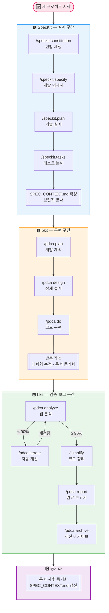

# SpecKit + bkit 통합 워크플로우 가이드

> **Spec-Driven Development(SDD) 기반 — 새 프로젝트/기능 개발 시 순차 실행 가이드**

## 개요

이 문서는 **SpecKit**(GitHub spec-kit)과 **bkit**(PDCA 사이클)을 함께 사용하여 기능을 개발하는 전체 워크플로우를 정리한 것입니다.

| 프레임워크 | 담당 구간 | 역할 | 핵심 질문 |
|-----------|---------|------|----------|
| **SpecKit** | 1~7.5단계 (설계 전담) | 헌법 제정 → 명세 → 기술 설계 → 태스크 분해 → 브릿지 문서 작성 | "**무엇을**, **왜** 만드는가?" |
| **bkit PDCA** | 8~17단계 (구현·검증·보고·동기화 전담) | 개발 계획 → 구현 → 갭 분석 → 개선 → 보고 → 문서 동기화 | "**어떻게** 만들고 **제대로** 됐는가?" |

**역할 분리 원칙**: 두 프레임워크는 `SPEC_CONTEXT.md`(7.5단계)를 경계로 완전히 분리됩니다.
SpecKit이 설계를 완료하면 bkit이 그 기준을 이어받아 구현·검증·보고를 끝까지 담당합니다.
`/speckit.implement`는 사용하지 않습니다 — 구현은 반드시 `/pdca do`로 진행합니다.

---

## ⚠️ 중요: bkit은 SpecKit 파일을 자동으로 읽지 않는다

`/pdca` 명령어를 실행해도 bkit이 SpecKit의 `specs/` 디렉토리를 **자동으로 스캔하지 않습니다.**
SpecKit 설계 산출물을 bkit에게 전달하는 방법은 세 가지입니다.

### 방법 A: 명령어 실행 시 명시적 언급 (권장)

```
/pdca plan 기능명
specs/NNN-기능명/ 디렉토리의 spec.md, plan.md, data-model.md, contracts/api.md를 기반으로 개발 계획을 작성해줘.
```

```
/pdca analyze 기능명
specs/NNN-기능명/plan.md와 specs/NNN-기능명/contracts/api.md를 설계 기준으로 사용해줘.
```

### 방법 B: CLAUDE.md `## Spec References` 섹션 최신화 (자동화 보완)

새 feature spec을 생성할 때마다 `CLAUDE.md`의 `## Spec References`에 경로를 추가합니다.
Claude 메인 에이전트는 이 파일을 항상 읽으므로, 별도 언급 없이도 spec 파일을 인식합니다.
단, **gap-detector·pdca-iterator 같은 서브에이전트**는 이 방법만으로는 불충분 — 명시적 경로 전달 필요.

| 상황 | A 방법 필요? | B 방법 필요? |
|------|------------|------------|
| `/pdca plan`, `/pdca design` | 없어도 동작 (Claude가 CLAUDE.md 참조) | 권장 |
| `/pdca analyze`, `/pdca iterate` | **반드시 필요** (서브에이전트 실행) | 필요 |
| `/pdca report` | 없어도 동작 | 권장 |

### 방법 C: SPEC_CONTEXT.md 브릿지 문서 (가장 편리)

SpecKit 산출물 전체를 하나의 파일(`SPEC_CONTEXT.md`)로 요약합니다. `/pdca` 명령어 실행 시 이 파일 하나만 언급하면 됩니다.

```
/pdca plan 기능명
SPEC_CONTEXT.md 파일을 참조해서 작업해줘.
```

```
/pdca analyze 기능명
SPEC_CONTEXT.md 파일을 설계 기준으로 사용해줘.
```

**SPEC_CONTEXT.md 포함 내용**: 헌법 요약, 기능 명세 요약, 기술 설계, 데이터 모델, API 계약, 도메인 규칙, 태스크 현황

**작성 시점**: `/speckit.tasks`(5단계) 완료 후, `/pdca plan`(8단계) 실행 전에 작성합니다.

**A/B 방법 대비 장점**:
- 파일 경로를 일일이 나열할 필요 없음
- 서브에이전트(gap-detector 등)에게도 단일 파일로 충분한 컨텍스트 전달 가능
- 여러 산출물의 핵심만 압축하여 토큰 효율적

---

## 사전 설치 — 도구 및 스킬 준비

> **새 프로젝트 시작 전 1회만 실행.** 이후 모든 단계에서 별도 설치 없이 명령어를 바로 사용합니다.

### 1. SpecKit 설치

```bash
# uv/uvx 설정 후 실행
uvx --from git+https://github.com/github/spec-kit.git specify init <PROJECT_NAME>
```

### 2. bkit 설치

```
/plugin marketplace add popup-studio-ai/bkit-claude-code
/plugin install bkit
```

### 3. Vercel React Best Practices 스킬 설치

8~10단계(개발 계획 → 상세 설계 → 구현)에서 프론트엔드 아키텍처 기준으로 사용합니다.

```bash
npx skills add https://github.com/vercel-labs/agent-skills --skill vercel-react-best-practices
```

설치 후에는 Claude Code 명령어에서 `@vercel-react-best-practices`로 참조하며, **8·9·10단계 실행 시 이 가이드라인을 먼저 읽고 기준에 맞춰 계획·설계·구현**을 진행합니다.

---

## 전체 플로우차트

> **새 프로젝트 기준** — 기존 프로젝트에서의 기능 추가·세션 재개는 [0단계 상세 가이드](#0단계-세션-재개--컨텍스트-회복) 참조



---

## 단계별 상세 가이드

---

### 🔁 세션 재개 — 기존 프로젝트로 돌아올 때

---

#### 0단계. 세션 재개 — 컨텍스트 회복

| 항목 | 내용 |
|------|------|
| **목적** | 새 Claude Code 세션에서 이전 작업 상태를 빠르게 복원 |
| **명령어** | `SPEC_CONTEXT.md` 읽기 요청 → `/pdca status` |
| **프레임워크** | Claude Code (SPEC_CONTEXT.md 읽기) + bkit (`/pdca status`) |
| **실행 시점** | 새 세션 시작 시 항상 (기존 프로젝트 작업 재개 시) |

**상세 설명**

Claude Code는 새 세션을 열면 이전 대화를 기억하지 못합니다. 단, `CLAUDE.md`는 항상 자동으로 읽히고, 17단계에서 최신화한 `SPEC_CONTEXT.md`가 현재 상태의 핵심 요약본입니다. 이 두 파일이 정확할수록 재개 속도가 빠릅니다.

**컨텍스트 회복 명령어**

```
SPEC_CONTEXT.md를 읽고 현재 프로젝트 상태를 파악해줘.
오늘 할 작업은 아래와 같아:
[버그 수정 / 기존 기능 계속 구현 / 새 기능 추가]
```

bkit 상태도 함께 확인:

```
/pdca status
```

**상황별 진입 단계**

| 상황 | 진입 단계 | 첫 실행 명령어 |
|------|----------|--------------|
| 🐛 버그 수정 / 소규모 UI 수정 | 직접 수정 | 자연어로 요청 |
| 🔄 기존 기능 계속 구현 (`tasks.md`에 `[ ]` 남음) | **10단계** | `/pdca do` |
| ✨ 새 기능 — **소·중규모** | **대화형 개발** | `npm run dev` 후 자연어로 요청 |
| ✨ 새 기능 — **대규모** | **8단계** | `/pdca plan` |
| ✨ 새 기능 — **초대규모** | **2단계** | `/speckit.specify` |

**기능 규모 판단 기준**

| 규모 | 해당하는 경우 | 접근 방식 |
|------|------------|----------|
| **소규모** | 단일 컴포넌트, 작은 로직 추가 | `npm run dev` + 대화형 → 완료 후 SPEC_CONTEXT.md 업데이트 |
| **중규모** | 여러 파일, UI 흐름 변경 | `npm run dev` + 대화형 → 10.5단계 → SPEC_CONTEXT.md 업데이트 |
| **대규모** | 기존 프로젝트에 새 기능 추가 (새 API, 새 페이지, 새 DB 테이블) | `/pdca plan` → `/pdca design` → `/pdca do` → 풀 bkit 플로우 |
| **초대규모** | 기존 구조를 갈아엎거나 거의 새 프로젝트 수준의 리팩터링 | 2단계(`/speckit.specify`)부터 풀 SpecKit → bkit 플로우 |

> **규모별 선택 기준**
> - **기존 위에 추가**되는 기능 → **`/pdca plan`** (기능명.plan.md로 관리, 직관적)
> - **기존 구조를 뒤흔드는** 변경 → **`/speckit.specify`** (번호 디렉토리로 새 설계 격리)

**수정 후 처리 기준**

| 변경 규모 | 처리 |
|----------|------|
| 마이너 UI 수정 | 문서 업데이트 없이 끝 |
| 로직 변경 | 10.5단계 (bkit design.md 갱신) |
| 소·중규모 신규 기능 | 대화형 개발 완료 후 SPEC_CONTEXT.md 업데이트 |
| 대규모 신규 기능 | `/pdca plan` → bkit 풀 플로우 → SPEC_CONTEXT.md 업데이트 |
| 초대규모 (구조 전면 개편) | `/speckit.specify` → SpecKit 풀 플로우 → bkit 풀 플로우 → 17단계 전체 |

**입력**: `SPEC_CONTEXT.md` (17단계에서 최신화된 상태)

**산출물**: 작업 방향 결정 및 진입 단계 확정

---

### 🅰 설계 구간 — SpecKit 중심

> 코드를 한 줄도 작성하기 전에, "무엇을 왜 만드는지"를 완전히 정의하는 구간

---

#### 1단계. 헌법 제정 — `/speckit.constitution`

| 항목 | 내용 |
|------|------|
| **목적** | 프로젝트 전체에서 반드시 지켜야 할 불변 원칙을 선언 |
| **명령어** | `/speckit.constitution` |
| **프레임워크** | SpecKit |
| **실행 시점** | 프로젝트 최초 1회 (이후 필요 시 개정) |

**상세 설명**

헌법은 AI 에이전트가 코드를 생성할 때 절대 위반해서는 안 되는 규칙을 정합니다. 예를 들어:
- "모든 비즈니스 로직은 순수 함수로 격리한다"
- "TypeScript Strict Mode를 반드시 사용한다"
- "테스트 없이 구현 코드를 작성하지 않는다"

**입력**: 프로젝트 원칙, 기술 제약, 품질 기준에 대한 자연어 설명

**산출물**:
- `.specify/memory/constitution.md` — 헌법 문서 (버전 관리됨)

**주의사항**:
- 헌법은 시맨틱 버저닝(MAJOR.MINOR.PATCH)으로 관리됩니다
- 이후 모든 SpecKit 명령어가 헌법을 참조하여 위반 여부를 검사합니다
- 한 번 정한 원칙은 명시적 개정 없이는 변경 불가

---

#### 2단계. 개발 명세서 작성 — `/speckit.specify`

| 항목 | 내용 |
|------|------|
| **목적** | 만들고자 하는 기능의 요구사항을 기술 독립적으로 정의 |
| **명령어** | `/speckit.specify` |
| **프레임워크** | SpecKit |
| **실행 시점** | 새 기능 개발 시작 시 |

**상세 설명**

"어떤 프레임워크를 쓸지"가 아니라 "사용자가 무엇을 할 수 있어야 하는지"를 정의합니다.

자연어로 기능을 설명하면, SpecKit이 다음을 자동 생성합니다:
- 사용자 시나리오 (User Stories)
- 기능 요구사항 (FR-001, FR-002 형식)
- 성공 기준 (측정 가능한 지표)
- 에지 케이스
- 모호한 부분은 `[NEEDS CLARIFICATION]` 마커로 표시

**입력**: "식단 기록 기능을 만들고 싶어. 사용자가 음식을 검색해서 끼니별로 기록하고, 하루 칼로리를 확인할 수 있어야 해."

**산출물**:
- `specs/NNN-기능명/spec.md` — 기능 명세서
- `specs/NNN-기능명/checklists/requirements.md` — 품질 체크리스트
- Git 브랜치 자동 생성 (`NNN-기능명`)

**주의사항**:
- 명세서에 기술 스택(React, Prisma 등)을 절대 포함하지 않습니다
- `[NEEDS CLARIFICATION]` 마커가 있으면 3단계(clarify)로 진행
- 마커가 없으면 4단계(plan)로 바로 진행 가능

---

#### 3단계. 명세 모호성 해소 — `/speckit.clarify` *(선택)*

| 항목 | 내용 |
|------|------|
| **목적** | 명세서의 모호한 부분을 구조화된 Q&A로 해소 |
| **명령어** | `/speckit.clarify` |
| **프레임워크** | SpecKit |
| **실행 시점** | 명세서에 `[NEEDS CLARIFICATION]` 마커가 있을 때 |

**상세 설명**

SpecKit이 명세서를 8개 차원에서 스캔합니다:
1. 기능 범위 및 동작
2. 도메인 및 데이터 모델
3. 상호작용 및 UX 흐름
4. 비기능 품질 속성 (성능, 보안 등)
5. 통합 및 외부 의존성
6. 에지 케이스 및 오류 처리
7. 제약 조건 및 트레이드오프
8. 용어 및 일관성

최대 5개의 우선순위 질문을 하나씩 제시하고, 답변을 즉시 명세서에 반영합니다.

**입력**: (자동) — 현재 spec.md를 분석

**산출물**:
- 업데이트된 `specs/NNN-기능명/spec.md` — `## Clarifications` 섹션 추가
- 커버리지 요약 리포트

**주의사항**:
- 선택 단계이지만, 모호한 명세로 설계에 들어가면 나중에 재작업이 큼
- "빠르게", "안전하게" 같은 정량화되지 않은 표현이 있으면 반드시 실행

---

#### 4단계. 기술 설계 — `/speckit.plan`

| 항목 | 내용 |
|------|------|
| **목적** | 기능 명세를 기술 아키텍처, 데이터 모델, API 계약으로 변환 |
| **명령어** | `/speckit.plan` |
| **프레임워크** | SpecKit |
| **실행 시점** | 명세서가 완성된 후 |

**상세 설명**

2개 Phase로 실행됩니다:

**Phase 0 — 리서치**:
- 기술 스택의 미결정 사항을 조사
- 라이브러리 비교, 성능 함의, 호환성 확인
- `research.md`에 "결정 / 근거 / 대안" 형식으로 기록

**Phase 1 — 설계**:
- 엔티티 추출 → `data-model.md` 생성 (필드, 관계, 유효성 규칙)
- API/인터페이스 계약 → `contracts/api.md` 생성
- 통합 테스트 시나리오 → `quickstart.md` 생성
- 헌법 위반 여부 검사 (위반 시 ERROR)

**입력**: spec.md + constitution.md

**산출물**:
- `specs/NNN-기능명/plan.md` — 기술 설계 문서
- `specs/NNN-기능명/research.md` — 기술 결정 기록
- `specs/NNN-기능명/data-model.md` — 데이터 모델
- `specs/NNN-기능명/contracts/api.md` — API 계약
- `specs/NNN-기능명/quickstart.md` — 통합 테스트 시나리오
- `CLAUDE.md` 또는 `AI_CONTEXT.md` 자동 업데이트

**주의사항**:
- `[NEEDS CLARIFICATION]` 마커가 남아있으면 ERROR로 중단
- 헌법의 MUST 원칙을 위반하는 설계는 게이트에서 차단됨

---

#### 5단계. 태스크 분해 — `/speckit.tasks`

| 항목 | 내용 |
|------|------|
| **목적** | 설계를 실행 가능한 작업 단위로 분해 |
| **명령어** | `/speckit.tasks` |
| **프레임워크** | SpecKit |
| **실행 시점** | 기술 설계 완료 후 |

**상세 설명**

설계 산출물 전체(plan.md, data-model.md, contracts/, research.md)를 읽고, Phase별 태스크를 생성합니다:

```
Phase 1: Setup (프로젝트 초기화)
Phase 2: Foundational (선행 필수 작업)
Phase 3+: User Stories (우선순위 순서)
Final: Polish (마무리 및 횡단 관심사)
```

태스크 형식:
```
- [ ] T001 [P] [US1] src/app/api/foods/route.ts 식품 검색 API 구현
```
- `T001`: 순차 실행 번호
- `[P]`: 병렬 실행 가능 (선택)
- `[US1]`: 사용자 스토리 매핑 (선택)
- 파일 경로 + 작업 설명

**입력**: plan.md, spec.md, data-model.md, contracts/

**산출물**:
- `specs/NNN-기능명/tasks.md` — 실행 가능한 태스크 목록

**주의사항**:
- 모든 태스크에 파일 경로가 포함되어야 함
- LLM이 추가 컨텍스트 없이 독립적으로 실행 가능해야 함
- `[P]` 마커는 의존성이 없는 태스크에만 부여

---

#### 6단계. 품질 체크리스트 — `/speckit.checklist` *(선택)*

| 항목 | 내용 |
|------|------|
| **목적** | 요구사항의 **작성 품질**을 검증하는 체크리스트 생성 |
| **명령어** | `/speckit.checklist` |
| **프레임워크** | SpecKit |
| **실행 시점** | 태스크 분해 후, 구현 전 (선택) |

**상세 설명**

"구현이 잘 됐는가?"가 아니라 **"요구사항이 잘 작성됐는가?"**를 검증합니다.

검증 차원:
- 요구사항 완전성 (누락된 요구사항이 없는가?)
- 요구사항 명확성 (모호하지 않은가?)
- 요구사항 일관성 (서로 충돌하지 않는가?)
- 수락 기준 품질 (측정 가능한가?)
- 시나리오 커버리지 (모든 흐름이 다뤄졌는가?)
- 에지 케이스 커버리지 (경계 조건이 정의됐는가?)

**입력**: spec.md, plan.md, tasks.md + 도메인 키워드 (예: "보안", "UX")

**산출물**:
- `specs/NNN-기능명/checklists/도메인.md` — 품질 체크리스트 (CHK001 형식)

**주의사항**:
- 올바른 예: "활성 사용자의 정의가 구체적으로 명시되어 있는가?" [명확성]
- 잘못된 예: "로그인 버튼을 클릭하면 대시보드로 이동하는가?" (이건 구현 테스트)

---

#### 7단계. 설계 일관성 분석 — `/speckit.analyze`

| 항목 | 내용 |
|------|------|
| **목적** | 명세·설계·태스크 간 교차 일관성을 비파괴적으로 검증 |
| **명령어** | `/speckit.analyze` |
| **프레임워크** | SpecKit |
| **실행 시점** | 구현에 들어가기 전 최종 점검 |

**상세 설명**

6가지 탐지를 수행합니다:
1. **중복 탐지**: 유사한 요구사항이 반복되는가?
2. **모호성 탐지**: "빠른", "안전한" 같은 비정량적 표현이 있는가?
3. **미명세 탐지**: 대상이나 결과가 빠진 요구사항이 있는가?
4. **헌법 정합성**: MUST 원칙을 위반하는 항목이 있는가? (CRITICAL)
5. **커버리지 갭**: 태스크가 없는 요구사항 / 요구사항이 없는 태스크가 있는가?
6. **불일치 탐지**: 용어 드리프트, 상충 요구사항, 잘못된 태스크 순서

**입력**: spec.md, plan.md, tasks.md, constitution.md

**산출물**:
- 분석 리포트 (텍스트 출력만, 파일 수정 없음)
- 발견사항 테이블 (ID | 카테고리 | 심각도 | 위치 | 요약 | 권고)
- 커버리지 메트릭스

**주의사항**:
- **읽기 전용** — 파일을 절대 수정하지 않음
- CRITICAL 발견이 있으면 구현 전에 반드시 해결
- 수정 계획은 사용자 승인 후에만 실행

---

#### 7.5단계. 브릿지 문서 작성 — `SPEC_CONTEXT.md`

| 항목 | 내용 |
|------|------|
| **목적** | SpecKit 산출물 전체를 하나로 요약하여 bkit이 참조할 단일 컨텍스트 파일 생성 |
| **명령어** | Claude에게 직접 요청 (별도 스킬 없음) |
| **프레임워크** | Claude Code (직접 요청) |
| **실행 시점** | `/speckit.analyze`(7단계) 통과 후, `/pdca plan`(8단계) 실행 전 |

**상세 설명**

bkit의 `/pdca` 명령어는 SpecKit 파일을 자동으로 읽지 않습니다. 특히 `gap-detector` 같은 서브에이전트는 완전히 독립된 컨텍스트로 실행되기 때문에, 매번 파일 경로를 나열하는 대신 **모든 SpecKit 산출물을 하나의 파일로 요약**해두고 bkit에 전달합니다.

**Claude에게 요청하는 방법**:

```
specs/NNN-기능명/ 디렉토리의 constitution.md, spec.md, plan.md,
data-model.md, contracts/api.md, tasks.md를 읽고
SPEC_CONTEXT.md 템플릿의 각 섹션을 채워줘.
```

Claude가 모든 파일을 읽고 `SPEC_CONTEXT.md`를 자동으로 채워줍니다.

**입력**: `.specify/memory/constitution.md` + `specs/NNN-기능명/` 전체

**산출물**:
- `SPEC_CONTEXT.md` — 채워진 브릿지 문서 (이 파일이 SpecKit → bkit 핸드오프의 유일한 연결점)

**이후 bkit 명령어 호출 패턴**:

8단계 — 개발 계획:
```
/pdca plan 기능명
SPEC_CONTEXT.md 파일을 참조해서 개발 계획을 세워줘.
@vercel-react-best-practices 가이드라인을 읽고 이 기준에 맞춰 개발 계획을 세워줘.
다음 세 가지 기준을 반드시 지켜야 해:
1. 헌법(constitution)의 모든 원칙을 준수할 것
2. spec.md의 모든 기능 요구사항(FR)을 빠짐없이 구현할 것
3. tasks.md의 모든 태스크를 완료 기준으로 삼을 것
```

9단계 — 상세 설계:
```
/pdca design 기능명
SPEC_CONTEXT.md 파일을 참조해서 작업해줘.
@vercel-react-best-practices 가이드라인을 읽고 이 기준에 맞춰 상세 설계를 작성해줘.
```

10단계 — 코드 구현:
```
/pdca do 기능명
SPEC_CONTEXT.md 파일을 참조해서 작업해줘.
@vercel-react-best-practices 가이드라인을 읽고 이 기준에 맞춰 구현해줘.
```

12단계 이후 (analyze · iterate · report):
```
/pdca analyze 기능명
/pdca iterate 기능명
/pdca report 기능명
```

**주의사항**:
- **이 단계 이후 SpecKit 명령어는 사용하지 않습니다** — 구현·검증·보고는 모두 bkit
- `/speckit.implement` 사용 금지 — 구현은 반드시 `/pdca do`
- 기능 명세가 변경될 때마다 SPEC_CONTEXT.md도 갱신 후 bkit 재실행
- 전체 파일 내용이 아닌 **핵심 요약**만 작성 (토큰 효율)

---

### 🅱 구현 구간 — bkit PDCA 전담

> 설계가 완료됐으므로 이제 실제 코드를 작성하고 리뷰하는 구간. 이 구간부터는 SpecKit 명령어를 사용하지 않습니다.

---

#### 8단계. PDCA 개발 계획 — `/pdca plan`

| 항목 | 내용 |
|------|------|
| **목적** | SpecKit의 설계 산출물을 기반으로 bkit PDCA 형식의 개발 계획 작성 |
| **명령어** | `/pdca plan 기능명` |
| **프레임워크** | bkit |
| **실행 시점** | 설계 일관성 분석(7단계) 통과 후 |

**상세 설명**

SpecKit의 plan.md와 tasks.md를 참조하여, bkit PDCA 형식의 개발 계획 문서를 생성합니다. 이 문서는 다음을 포함합니다:
- 개발 목표 및 범위
- 기술 스택 확인
- 구현 단계별 계획
- 예상 리스크 및 대응 전략

SpecKit의 기술 설계(plan.md)가 "무엇을 어떤 구조로 만들지"를 정의했다면, PDCA plan은 "어떤 순서와 전략으로 구현할지"에 집중합니다.

**입력**: `SPEC_CONTEXT.md` (7.5단계 산출물)

**핸드오프 호출 패턴** — 아래 기준을 반드시 포함해서 전달합니다:

```
/pdca plan 기능명
SPEC_CONTEXT.md 파일을 참조해서 개발 계획을 세워줘.
@vercel-react-best-practices 가이드라인을 읽고 이 기준에 맞춰 개발 계획을 세워줘.
다음 세 가지 기준을 반드시 지켜야 해:
1. 헌법(constitution)의 모든 원칙을 준수할 것
2. spec.md의 모든 기능 요구사항(FR)을 빠짐없이 구현할 것
3. tasks.md의 모든 태스크를 완료 기준으로 삼을 것
```

**산출물**:
- `docs/01-plan/features/기능명.plan.md` — PDCA 개발 계획서

---

#### 9단계. PDCA 상세 설계 — `/pdca design`

| 항목 | 내용 |
|------|------|
| **목적** | 구현 직전의 상세 설계 문서 작성 (컴포넌트, 함수, 파일 구조 수준) |
| **명령어** | `/pdca design 기능명` |
| **프레임워크** | bkit |
| **실행 시점** | PDCA 개발 계획 작성 후 |

> ✅ `vercel-react-best-practices` 스킬은 프로젝트 시작 시 이미 설치되어 있습니다. ([사전 설치](#사전-설치--도구-및-스킬-준비) 참조)

**상세 설명**

SpecKit의 data-model.md와 contracts/api.md를 참조하여, 실제 구현에 필요한 세부 수준의 설계를 작성합니다. **`@vercel-react-best-practices` 가이드라인을 먼저 읽고 이 기준에 맞춰 상세 설계를 작성**합니다:
- 컴포넌트 구조 및 Props 인터페이스
- 함수 시그니처 및 반환 타입
- 상태 관리 전략
- 에러 핸들링 패턴
- Vercel React Best Practices 가이드라인 준수 여부

**호출 패턴**:

```
/pdca design 기능명
SPEC_CONTEXT.md 파일을 참조해서 작업해줘.
@vercel-react-best-practices 가이드라인을 읽고 이 기준에 맞춰 상세 설계를 작성해줘.
```

**입력**: PDCA plan + SpecKit 설계 산출물

**산출물**:
- `docs/02-design/features/기능명.design.md` — PDCA 상세 설계서

---

#### 10단계. 구현 — `/pdca do`

| 항목 | 내용 |
|------|------|
| **목적** | bkit PDCA plan/design 문서를 기반으로 구현 가이드 및 실제 코드 작성 |
| **명령어** | `/pdca do 기능명` |
| **프레임워크** | bkit |
| **실행 시점** | PDCA 상세 설계 완료 후 |

> ✅ `vercel-react-best-practices` 스킬은 프로젝트 시작 시 이미 설치되어 있습니다. ([사전 설치](#사전-설치--도구-및-스킬-준비) 참조)

**상세 설명**

bkit의 plan/design 문서를 읽고 구현 순서와 방법을 가이드하며 코드를 작성합니다. SPEC_CONTEXT.md를 함께 전달하면 SpecKit의 헌법·도메인 규칙·API 계약을 준수한 구현이 가능합니다.

```
/pdca do 기능명
SPEC_CONTEXT.md 파일을 참조해서 작업해줘.
@vercel-react-best-practices 가이드라인을 읽고 이 기준에 맞춰 구현해줘.
```

**입력**: PDCA plan + design 문서 + SPEC_CONTEXT.md

**산출물**:
- 구현된 소스 코드

---

#### 10.5단계. 반복 개선 & bkit 문서 동기화

| 항목 | 내용 |
|------|------|
| **목적** | `/pdca do` 이후 사용자 요청으로 누적된 코드 변경을 bkit plan/design 문서에 반영 |
| **명령어** | Claude에게 직접 요청 |
| **프레임워크** | Claude Code (직접 요청) |
| **실행 시점** | 반복 개선 완료 후, 코드 리뷰(11단계) 진입 전 |

**상세 설명**

`/pdca do`로 초기 구현이 완료된 후, 사용자는 Claude와 대화하며 UI를 수정하고 로직을 추가하는 등 자유롭게 코드를 변경합니다. 이 변경들은 자동으로 문서에 반영되지 않으므로, 코드 리뷰와 갭 분석 전에 **bkit plan/design 문서를 현재 코드 기준으로 동기화**해야 합니다.

> **왜 bkit plan/design인가?**
> `/pdca analyze`(12단계)는 SpecKit spec.md가 아닌 **bkit plan/design 문서와 코드를 비교**합니다.
> plan/design이 구식이면 갭 분석 결과가 실제 의도와 달라집니다.

**변경 크기별 처리 기준**

| 변경 유형 | 예시 | bkit 문서 업데이트 |
|-----------|------|-----------------|
| 마이너 UI | 색상, 여백, 폰트, 텍스트 | ❌ 불필요 |
| 로직·UX 변경 | 계산 방식 수정, 화면 흐름 변경 | ✅ bkit design.md 수정 |
| 신규 기능 추가 | 새 화면, 새 API, 새 기능 | ✅ bkit plan.md + design.md 추가 |

**변경 직후 실시간 반영 (권장)**

```
방금 [칼로리 계산 로직 변경] 내용을
bkit design 문서의 관련 섹션에 반영해줘.
```

```
방금 추가한 [다크모드 기능]을
bkit plan 문서에 추가하고, design 문서에도 상세 설계를 추가해줘.
```

**여러 변경 후 배치 반영 (11단계 진입 직전)**

```
지금까지 대화에서 코드에 적용된 변경 사항을 모두 파악해서
bkit plan/design 문서를 현재 코드 상태에 맞게 업데이트해줘.
변경된 항목 목록도 알려줘.
```

**입력**: 대화 중 누적된 코드 변경 사항

**산출물**:
- bkit plan 문서 갱신
- bkit design 문서 갱신

---

#### 11단계. 코드 리뷰 — `/code-review`

| 항목 | 내용 |
|------|------|
| **목적** | 구현된 코드의 품질, 보안, 패턴 준수를 검토 |
| **명령어** | `/code-review` |
| **프레임워크** | bkit 스킬 |
| **실행 시점** | 구현 완료 후 (또는 주요 기능 단위 완료 시) |

**상세 설명**

구현된 코드를 다음 관점에서 리뷰합니다:
- 코드 품질 및 가독성
- 보안 취약점 (OWASP Top 10)
- 헌법 원칙 준수 여부
- 성능 이슈
- 중복 코드 및 리팩터링 기회

**입력**: 변경된 소스 코드

**산출물**:
- 코드 리뷰 리포트 (개선 제안 포함)

---

### 🅲 검증·개선·보고 구간 — bkit 중심

> 구현이 설계대로 됐는지 검증하고, 미흡한 부분을 자동 개선한 뒤 보고서를 작성

---

#### 12단계. 갭 분석 — `/pdca analyze`

| 항목 | 내용 |
|------|------|
| **목적** | 설계 문서와 실제 구현 간의 갭(차이)을 탐지 |
| **명령어** | `/pdca analyze 기능명` |
| **프레임워크** | bkit |
| **실행 시점** | 구현 및 코드 리뷰 완료 후 |
| **사용 에이전트** | `gap-detector` |

**상세 설명**

bkit의 `gap-detector` 에이전트가 설계 문서(plan.md, design.md)와 실제 구현 코드를 비교하여:
- 설계에는 있지만 구현되지 않은 항목
- 구현됐지만 설계에 없는 항목 (scope creep)
- 설계와 다르게 구현된 항목
- **Match Rate** (일치율) 계산

**입력**: 설계 문서 + 구현된 소스 코드

**산출물**:
- 갭 분석 리포트 (Match Rate 포함)
- 미구현 항목 목록
- 수정 필요 항목 목록

**분기점**:
- **Match Rate >= 90%** → 14단계(QA 검증)로 진행
- **Match Rate < 90%** → 13단계(자동 개선)로 진행

> **⚠️ 서브에이전트 주의**: `/pdca analyze`는 내부적으로 `gap-detector` 서브에이전트를 실행합니다. 8~10단계에서 이미 SPEC_CONTEXT.md 기반으로 bkit plan/design 문서가 생성되었으므로, analyze는 그 문서와 코드를 비교합니다.
> ```
> /pdca analyze 기능명
> ```

---

#### 13단계. 자동 개선 — `/pdca iterate` *(조건부)*

| 항목 | 내용 |
|------|------|
| **목적** | 갭 분석에서 발견된 미흡 사항을 자동으로 수정 |
| **명령어** | `/pdca iterate 기능명` |
| **프레임워크** | bkit |
| **실행 시점** | Match Rate < 90%일 때 자동 트리거 |
| **사용 에이전트** | `pdca-iterator` |

**상세 설명**

`pdca-iterator` 에이전트가 Generator-Evaluator 패턴으로 동작합니다:
1. 갭 분석 결과를 기반으로 코드 수정
2. 수정 후 gap-detector를 재실행하여 Match Rate 확인
3. Match Rate >= 90%에 도달하거나 최대 5회 반복까지 계속

**입력**: 갭 분석 리포트 + 소스 코드

**산출물**:
- 수정된 소스 코드
- 반복별 Match Rate 변화 추적

**주의사항**:
- 최대 5회 반복 후 자동 중단
- 매 반복마다 gap-detector를 재실행하여 검증
- 5회 반복 후에도 90% 미달 시 수동 개입 필요

---

#### 14단계. QA 검증 — `/zero-script-qa` *(선택)*

| 항목 | 내용 |
|------|------|
| **목적** | 테스트 스크립트 없이 실시간 로그 기반 검증 |
| **명령어** | `/zero-script-qa` |
| **프레임워크** | bkit 스킬 |
| **실행 시점** | Match Rate >= 90% 달성 후 |
| **사용 에이전트** | `qa-monitor` |

**상세 설명**

> ⚠️ **중요**: `/zero-script-qa`는 **QA를 자동으로 실행해주는 명령어가 아닙니다.**
> QA 시나리오 설계 + 로그 모니터링 방법을 안내해주는 **가이드 도구**입니다.
> 실제 테스트는 사용자가 직접 브라우저에서 수동으로 실행해야 합니다.

Docker 로그를 실시간 모니터링하여 테스트 스크립트 없이 기능을 검증합니다:
- 테스트 시나리오 목록 자동 생성 (가이드)
- 구조화된 JSON 로깅을 통한 동작 검증 방법 안내
- API 요청/응답 모니터링 방법 안내
- 에러 패턴 탐지 기준 안내

**실제 QA 자동 실행**은 `qa-monitor` 에이전트가 담당하며, Docker 로그를 실시간 스트리밍하여 AI가 이슈를 자동 감지합니다.
`qa-monitor`를 활용한 자동 실행 가이드는 **프로젝트에 Docker(`docker-compose.yml`)가 있을 때만 제공됩니다.**

**입력**: 실행 중인 애플리케이션 + 테스트 시나리오

**산출물**:
- QA 시나리오 가이드 (자동 생성)
- QA 검증 리포트 (사용자가 직접 테스트 후 결과 기록)

**주의사항**:
- `qa-monitor` 자동 실행은 Docker 환경이 필요합니다
- Docker 없는 프로젝트(Next.js dev server 등)는 `npm run dev` 터미널 로그를 직접 확인하며 수동 테스트
- 프론트엔드만 있는 프로젝트에서는 적용이 제한적일 수 있음

---

#### 15단계. 코드 정리 — `/simplify`

| 항목 | 내용 |
|------|------|
| **목적** | 구현 완료 후 코드의 재사용성, 품질, 효율성을 개선 |
| **명령어** | `/simplify` |
| **프레임워크** | Claude Code 내장 명령어 |
| **실행 시점** | QA 검증 후 (또는 Match Rate >= 90% 달성 후) |

**상세 설명**

변경된 코드를 검토하여:
- 중복 코드 제거 및 공통 유틸리티 추출
- 불필요한 복잡성 제거
- 코드 패턴 일관성 확보
- 사용되지 않는 코드 정리
- 발견된 문제가 있으면 자동 수정

**입력**: 변경된 소스 코드

**산출물**:
- 정리된 소스 코드

---

#### 16단계. 완료 보고서 — `/pdca report`

| 항목 | 내용 |
|------|------|
| **목적** | 기능 구현의 전체 PDCA 사이클을 요약한 완료 보고서 생성 |
| **명령어** | `/pdca report 기능명` |
| **프레임워크** | bkit |
| **실행 시점** | 모든 검증/개선 완료 후 (마지막 단계) |
| **사용 에이전트** | `report-generator` |

**상세 설명**

전체 개발 사이클을 정리한 보고서를 생성합니다:
- 계획 대비 실행 결과 비교
- Match Rate 최종 수치
- 변경된 파일 수, 코드 라인 수
- 발견된 이슈 및 해결 방법
- 학습 사항 (다음 기능 개발에 활용)
- 4관점 가치 테이블 (문제 / 솔루션 / 기능 UX 효과 / 핵심 가치)

**입력**: 전체 PDCA 산출물 (plan, design, gap analysis, code review 등)

**산출물**:
- 완료 보고서 문서

---

#### 16.5단계. 세션 아카이브 — `/pdca archive`

| 항목 | 내용 |
|------|------|
| **목적** | 완료된 PDCA 문서를 아카이브 폴더로 이동하여 작업 공간 정리 |
| **명령어** | `/pdca archive 기능명` |
| **프레임워크** | bkit |
| **실행 시점** | `/pdca report`(16단계) 완료 직후, 세션을 마무리할 때 |

**상세 설명**

보고서 완료 후 이번 사이클의 bkit 문서를 아카이브로 정리합니다:
- `docs/01-plan/features/기능명.plan.md` → `docs/archive/YYYY-MM/기능명/`
- `docs/02-design/features/기능명.design.md` → `docs/archive/YYYY-MM/기능명/`
- 경량 요약본은 `.bkit/state/pdca-status.json`의 `archivedFeatures`에 보존

```
/pdca archive 기능명
```

`--summary` 옵션 사용 시 주요 지표(Match Rate, 파일 수, 라인 수)만 남기고 나머지 삭제:

```
/pdca archive 기능명 --summary
```

**입력**: 16단계 완료 보고서 + bkit PDCA 문서 전체

**산출물**:
- `docs/archive/YYYY-MM/기능명/` 아카이브 디렉토리
- `.bkit/state/pdca-status.json` 갱신 (해당 기능이 `archivedFeatures`로 이동)

> **주의**: SpecKit `specs/` 디렉토리는 아카이브하지 않습니다. SpecKit 문서는 17단계 동기화 후에도 프로젝트 참조 문서로 영구 보존됩니다.

---

#### 17단계. SpecKit 문서 사후 동기화 / SPEC_CONTEXT.md 갱신

| 항목 | 내용 |
|------|------|
| **목적** | 현재 코드를 기준으로 문서를 역방향 동기화하고 SPEC_CONTEXT.md를 최신화 |
| **명령어** | SpecKit 사용 시: Claude 요청 → `/speckit.analyze` / bkit 직접 사용 시: SPEC_CONTEXT.md 직접 업데이트 |
| **프레임워크** | SpecKit + Claude Code (SpecKit 사용 시) / Claude Code (bkit 직접 사용 시) |
| **실행 시점** | `/pdca report`(16단계) 완료 후 |

> **⚠️ 적용 범위**: 이 단계는 **기능을 어떤 방식으로 설계했느냐**에 따라 달라집니다.

| 설계 방식 | 17단계 처리 |
|----------|------------|
| **SpecKit 사용** (1~7단계 거침) | `specs/NNN-기능명/` 전체 동기화 — tasks.md `[x]`, spec.md 갱신, `/speckit.analyze` 실행 |
| **`/pdca plan` 직접 사용** (대규모 신규 기능) | SpecKit 파일 없음 — SPEC_CONTEXT.md의 태스크 현황 섹션만 업데이트 |

**상세 설명 (SpecKit 사용 시)**

`/pdca do` 이후 반복 개선(10.5단계)을 거치면서 코드에는 원래 spec에 없던 기능이 추가되거나, 기존 로직이 바뀌거나, 일부 기획이 제거될 수 있습니다. SpecKit의 tasks.md는 이 변화를 전혀 모릅니다 — **원래 태스크의 체크박스만 존재하고, 새로 추가된 기능의 태스크는 아예 없습니다.**

SDD의 **Bidirectional Feedback** 원칙에 따라, 현재 코드를 기준으로 SpecKit 문서 전체를 역방향 동기화합니다.

**처리해야 할 4가지 케이스** *(SpecKit 사용 시에만 해당)*

| 케이스 | 처리 방법 |
|--------|----------|
| ① 원래 태스크 완료 | `[ ]` → `[x]` |
| ② 기존 기능 로직 변경 | 해당 FR 내용 수정 + 태스크 `[x]` + 변경 이유 주석 |
| ③ 새 기능 추가 (반복 개선 중 생긴 것) | spec.md에 새 FR 추가 + tasks.md에 새 태스크 추가 후 `[x]` |
| ④ 기획된 기능 제거 | 해당 FR에 `deprecated` 표시 + 태스크 취소 표시 |

**3단계 실행 순서**:

---

**상세 설명 (`/pdca plan` 직접 사용 시)**

SpecKit 파일(`spec.md`, `tasks.md`)이 없으므로, 대신 SPEC_CONTEXT.md를 업데이트합니다:

```
방금 완료한 [기능명] 구현 내용을 SPEC_CONTEXT.md의 태스크 현황 섹션에 반영해줘.
완료된 항목과 추가된 기능을 정리해줘.
```

**[1] spec.md + tasks.md 통합 동기화**

```
현재 구현된 코드와 원래 specs/NNN-기능명/을 비교해서
아래 네 가지를 모두 처리해줘:

1. 완료된 기존 태스크: [ ] → [x]
2. 수정된 기존 기능: 해당 FR을 실제 구현에 맞게 업데이트
   (FR 번호 유지, 변경 이유를 <!-- 변경: ... --> 주석으로 추가)
3. 새로 추가된 기능: spec.md에 새 FR 추가 + tasks.md에 새 태스크 추가 후 [x]
4. 제거된 기능이 있다면: 해당 FR에 deprecated 표시

처리 완료 후 변경된 항목 목록을 케이스별로 요약해줘.
```

**[2] /speckit.analyze 최종 검증**

```
/speckit.analyze
```

spec.md ↔ plan.md ↔ tasks.md 간 최종 문서 일관성을 확인합니다.
> ※ 코드 vs bkit plan/design 비교는 12단계(`/pdca analyze`)에서 완료.
> 이 단계는 **SpecKit 문서 간** 정합성 검증.

**[3] SPEC_CONTEXT.md 갱신**

```
방금 업데이트한 spec.md와 tasks.md 내용을 반영해서
SPEC_CONTEXT.md의 기능 명세 요약, 도메인 규칙, 태스크 현황 섹션을
최종 완료 상태로 갱신해줘.
```

**입력**: 구현된 소스 코드 + 원래 SpecKit 산출물 (spec.md, tasks.md)

**산출물**:
- `specs/NNN-기능명/spec.md` — FR 전체 현실 반영 (수정·추가·deprecated)
- `specs/NNN-기능명/tasks.md` — 기존 `[x]` + 새 태스크 추가 후 `[x]`
- `SPEC_CONTEXT.md` — 최종 상태 갱신

> **왜 마지막에 SpecKit으로 되돌아오는가?**
> SpecKit 문서는 "과거의 설계 의도"를, 코드는 "현재의 구현 현실"을 나타냅니다.
> 반복 개선을 거치면 이 둘은 반드시 벌어집니다.
> 17단계는 이 간극을 매 사이클마다 제거하는 **SDD 피드백 루프의 닫힘점**입니다.
> 다음 기능 개발 시 `/speckit.specify`가 이 문서를 읽고 시작하므로,
> 정확한 현재 상태가 기록되어 있어야 다음 설계가 올바른 전제에서 출발합니다.

---

## 요약 테이블

| # | 구간 | 단계명 | 명령어 | 필수 여부 | 산출물 |
|---|------|--------|--------|-----------|--------|
| 0 | 🔁 재개 | **세션 재개 & 컨텍스트 회복** | `SPEC_CONTEXT.md` 읽기 → `/pdca status` | **기존 프로젝트 시 항상** | 작업 방향 결정 |
| 1 | 🅰 설계 | 헌법 제정 | `/speckit.constitution` | 필수 (최초 1회) | constitution.md |
| 2 | 🅰 설계 | 개발 명세서 | `/speckit.specify` | 신규 프로젝트 또는 초대규모 변경 시 | spec.md |
| 3 | 🅰 설계 | 모호성 해소 | `/speckit.clarify` | 선택 | spec.md 업데이트 |
| 4 | 🅰 설계 | 기술 설계 | `/speckit.plan` | 필수 | plan.md, research.md, data-model.md, contracts/ |
| 5 | 🅰 설계 | 태스크 분해 | `/speckit.tasks` | 필수 | tasks.md |
| 6 | 🅰 설계 | 품질 체크리스트 | `/speckit.checklist` | 선택 | checklists/*.md |
| 7 | 🅰 설계 | 설계 일관성 분석 | `/speckit.analyze` | 권장 | 분석 리포트 (텍스트) |
| 7.5 | 🅰→🅱 | **브릿지 문서 작성** | Claude에게 직접 요청 | **필수** | **SPEC_CONTEXT.md** |
| 8 | 🅱 구현 | PDCA 개발 계획 | `/pdca plan` | 필수 | PDCA plan 문서 |
| 9 | 🅱 구현 | PDCA 상세 설계 | `/pdca design` | 필수 | PDCA design 문서 |
| 10 | 🅱 구현 | 코드 구현 | `/pdca do` | 필수 | 소스 코드 |
| 10.5 | 🅱 구현 | **반복 개선 & bkit 문서 동기화** | Claude에게 직접 요청 | **필수** | bkit plan/design 문서 갱신 |
| 11 | 🅱 구현 | 코드 리뷰 | `/code-review` | 권장 | 리뷰 리포트 |
| 12 | 🅲 검증 | 갭 분석 | `/pdca analyze` | 필수 | 갭 분석 리포트 |
| 13 | 🅲 검증 | 자동 개선 | `/pdca iterate` | 조건부 (<90%) | 수정된 코드 |
| 14 | 🅲 검증 | QA 검증 | `/zero-script-qa` | 선택 | QA 리포트 |
| 15 | 🅲 검증 | 코드 정리 | `/simplify` | 권장 | 정리된 코드 |
| 16 | 🅲 검증 | 완료 보고서 | `/pdca report` | 필수 | 완료 보고서 |
| 16.5 | 🅲 정리 | **세션 아카이브** | `/pdca archive` | 권장 | `docs/archive/YYYY-MM/기능명/` + `.bkit/state/pdca-status.json` 갱신 |
| 17 | 🅳 동기화 | **문서 사후 동기화** | SpecKit 사용 시: `/speckit.analyze` / `/pdca plan` 사용 시: SPEC_CONTEXT.md 직접 업데이트 | **필수** | SpecKit: tasks.md [x] + spec.md 갱신 / bkit: SPEC_CONTEXT.md 갱신 |

---

## 빠른 참조 — 최소 실행 경로

모든 단계를 실행할 시간이 없을 때, **필수 단계만** 순서대로:

```
/speckit.constitution → /speckit.specify → /speckit.plan → /speckit.tasks
→ [SPEC_CONTEXT.md 작성] → /pdca plan → /pdca design → 구현
→ /pdca analyze → /pdca report → [tasks.md [x] 업데이트] → /speckit.analyze
```

10단계로 축소된 최소 경로이며, 나머지는 품질을 높이기 위한 선택/권장 단계입니다.

---

## FAQ

**Q: SpecKit의 `/speckit.plan`과 bkit의 `/pdca plan`은 뭐가 다른가요?**

A: `/speckit.plan`은 기술 아키텍처 설계(데이터 모델, API 계약, 기술 스택 결정)에 집중합니다. `/pdca plan`은 그 설계를 바탕으로 "어떤 순서와 전략으로 구현할지"를 계획합니다. 전자는 "무엇을 만들지", 후자는 "어떻게 만들지"입니다.

**Q: `/speckit.analyze`와 `/pdca analyze`는 뭐가 다른가요?**

A: `/speckit.analyze`는 구현 **전**에 명세-설계-태스크 간의 문서 일관성을 검증합니다. `/pdca analyze`는 구현 **후**에 설계 문서와 실제 코드 간의 갭을 검증합니다.

**Q: 작은 기능도 이 모든 단계를 거쳐야 하나요?**

A: 아닙니다. 단순한 버그 수정이나 1~2파일 변경은 직접 수정하면 됩니다. 이 워크플로우는 **새 기능 개발**(여러 파일, 새 API, 새 화면 등)에 적합합니다.

**Q: 기존 프로젝트에 새 기능을 추가할 때도 1단계부터 시작하나요?**

A: 헌법(1단계)은 프로젝트당 최초 1회만 실행합니다. 이후 기능 추가는 **규모**에 따라 진입점이 다릅니다:

- **소·중규모**: `npm run dev` + 대화형 → 완료 후 SPEC_CONTEXT.md 업데이트
- **대규모** (기존 위에 추가): `/pdca plan`(8단계)부터 bkit 풀 플로우
- **초대규모** (구조 전면 개편): `/speckit.specify`(2단계)부터 SpecKit → bkit 풀 플로우

**Q: `/pdca` 명령을 치면 bkit이 SpecKit의 spec 파일을 자동으로 읽나요?**

A: **읽지 않습니다.** 두 프레임워크 간에 자동 연동은 없습니다.

- `/pdca plan`, `/pdca design`, `/pdca report` → Claude 메인 에이전트가 처리. `CLAUDE.md`의 `## Spec References`에 경로가 있으면 **어느 정도 자동 인식** 가능.
- `/pdca analyze`, `/pdca iterate` → 내부적으로 `gap-detector`·`pdca-iterator` **서브에이전트** 실행. 서브에이전트는 별도 컨텍스트로 실행되므로 **반드시 명시적으로 파일 경로를 전달**해야 합니다.

**실용적 규칙**: `/pdca analyze` 실행 시에는 항상 `specs/NNN-기능명/` 경로를 함께 적어주세요.

---

**Q: `/speckit.specify`와 `/pdca plan`은 새 기능 추가 시 기존 파일을 덮어쓰나요?**

A: **둘 다 덮어쓰지 않습니다.** 단, 파일 관리 방식이 서로 다릅니다.

| | SpecKit `/speckit.specify` | bkit `/pdca plan` |
|---|---|---|
| **저장 방식** | 번호 디렉토리 자동 생성 | `기능명.plan.md` 파일 생성 |
| **경로** | `specs/NNN-기능명/spec.md` | `docs/01-plan/features/기능명.plan.md` |
| **새 기능 추가** | 번호 자동 증가 → 새 디렉토리 | 다른 기능명 사용 → 새 파일 |
| **같은 이름 재실행** | 번호 증가로 충돌 없음 | 기존 파일 표시 후 수정 제안 (덮어쓰지 않음) |

```
# 새 기능 추가 시 결과 예시
specs/                                    docs/01-plan/features/
├── 001-pomodoro-timer/  ← 기존           ├── pomodoro-timer.plan.md  ← 기존
│   └── spec.md                           └── monthly-stats.plan.md   ← 신규
└── 002-monthly-stats/   ← 신규
    └── spec.md
```

여러 기능의 진행 상태는 `.bkit/state/pdca-status.json`의 `activeFeatures` 배열로 추적합니다.

---

## 예시 시나리오: 포모도로 타이머 앱

> **새 프로젝트를 처음 시작하는 경우의 전체 실행 예시**
> 전제: 새 프로젝트 폴더에서 `specify init`을 이미 실행한 상태

---

### 📅 Day 1 — 새 프로젝트 처음 시작

> 전제: 새 프로젝트 폴더에서 `specify init`을 이미 실행한 상태

### 🅰 설계 구간 (SpecKit)

#### 1단계 — `/speckit.constitution`

```
/speckit.constitution
우리 프로젝트의 핵심 원칙을 제정해줘:
- TypeScript Strict Mode + Next.js App Router
- CSS Modules만 사용 (Tailwind 금지)
- 도메인 로직은 src/domain/에 순수 함수로 격리
- 핵심 도메인 규칙(타이머 상수 등)은 반드시 상수로 정의
- 모든 문서는 한글로 작성
```

산출물: `.specify/memory/constitution.md`

---

#### 2단계 — `/speckit.specify`

```
/speckit.specify
포모도로 타이머 앱을 만들고 싶어.
- 25분 집중 / 5분 짧은 휴식 / 15분 긴 휴식 사이클
- 4번 집중하면 자동으로 긴 휴식으로 전환
- 타이머 시작/일시정지/초기화 가능
- 오늘 완료한 뽀모도로 횟수 표시
- 알림음 재생 (사이클 완료 시)
```

산출물: `specs/001-pomodoro-timer/spec.md` (FR-001~005 정의, `[NEEDS CLARIFICATION]` 포함)

```markdown
[NEEDS CLARIFICATION: 뽀모도로 횟수를 로그인 없이 로컬에 저장할지,
서버 DB에 영구 저장할지?]
```

---

#### 3단계 — `/speckit.clarify`

```
뽀모도로 횟수 저장 방식 — 로컬 스토리지로 할게, 로그인 없이 심플하게.
```

spec.md 자동 업데이트:

```markdown
FR-006: 완료 횟수는 localStorage에 날짜별(`pomodoro-YYYY-MM-DD` 키)로 저장된다.
        로그인·서버 저장 없음. 브라우저 초기화 시 데이터 삭제.
```

---

#### 4단계 — `/speckit.plan`

```
/speckit.plan
specs/001-pomodoro-timer/spec.md를 기반으로 기술 설계를 해줘.
```

산출물: `plan.md`, `data-model.md`, `contracts/api.md`

plan.md 발췌:

```markdown
## 기술 스택
- Next.js 14 (App Router) + TypeScript Strict
- 상태 관리: useState + useEffect (외부 라이브러리 없음)
- 데이터 저장: localStorage (서버 불필요)
- 알림음: Web Audio API

## 프로젝트 구조
src/
├── app/page.tsx
├── components/
│   ├── TimerDisplay.tsx
│   ├── TimerControls.tsx
│   └── SessionCounter.tsx
├── domain/pomodoro/
│   ├── constants.ts     # WORK_MINUTES=25, SHORT_BREAK=5, LONG_BREAK=15
│   ├── calculator.ts    # 다음 단계 계산, 진행률 계산
│   └── storage.ts       # localStorage 읽기/쓰기
└── hooks/usePomodoro.ts
```

---

#### 5단계 — `/speckit.tasks`

```
/speckit.tasks
specs/001-pomodoro-timer/plan.md를 기반으로 태스크를 분해해줘.
```

산출물: `tasks.md` (T001~T042)

```markdown
## Phase 1: 프로젝트 초기화
- [ ] T001: Next.js 14 + TypeScript 프로젝트 생성
- [ ] T002: CSS Modules 기본 설정

## Phase 2: 도메인 로직 [PARALLEL]
- [ ] T010: constants.ts (타이머 상수 정의)
- [ ] T011: calculator.ts (다음 단계 계산 함수)
- [ ] T012: storage.ts (localStorage CRUD)

## Phase 3: 커스텀 훅
- [ ] T020: usePomodoro.ts (타이머 상태 + 전환 로직)

## Phase 4: UI 컴포넌트 [PARALLEL]
- [ ] T030: TimerDisplay (남은 시간 표시)
- [ ] T031: TimerControls (시작/일시정지/초기화)
- [ ] T032: SessionCounter (오늘의 뽀모도로 횟수)

## Phase 5: 통합
- [ ] T040: app/page.tsx 전체 조합
- [ ] T041: Web Audio API 알림음 연결
- [ ] T042: 반응형 스타일 완성
```

---

#### 6단계 — `/speckit.checklist` (선택)

```
/speckit.checklist
```

체크리스트 예시 (발췌):

```markdown
- [ ] FR-001~006 모두 구현되었는가?
- [ ] 4번째 뽀모도로 완료 시 긴 휴식(15분)으로 전환되는가?
- [ ] 타이머 상수가 constants.ts에만 존재하는가? (컴포넌트 하드코딩 없음)
- [ ] localStorage 접근이 storage.ts를 통해서만 이루어지는가?
- [ ] TypeScript any 사용 없음
```

---

#### 7단계 — `/speckit.analyze` (권장)

```
/speckit.analyze
```

분석 결과 예시:

```
✅ FR-001~006 모두 tasks.md에 대응 태스크 존재
✅ plan.md 기술 스택이 constitution 원칙 준수
⚠️ localStorage 날짜 키 포맷이 spec.md에 미정의
   → storage.ts 설계 시 "pomodoro-YYYY-MM-DD" 포맷으로 결정 필요
```

---

#### 7.5단계 — SPEC_CONTEXT.md 브릿지 문서 작성

> ⚠️ **이 단계 이후 SpecKit 명령어는 사용하지 않습니다.**
> 구현·검증·보고는 모두 bkit이 담당합니다.

```
specs/001-pomodoro-timer/ 아래 모든 산출물과
.specify/memory/constitution.md를 읽고
SPEC_CONTEXT.md에 핵심 내용을 요약해서 채워줘.
```

작성 완료된 SPEC_CONTEXT.md 발췌:

```markdown
## 🚨 bkit 개발 기준 (필수 준수)
| # | 기준 | 내용 |
|---|------|------|
| 1 | 헌법 준수 | 도메인 로직 격리, CSS Modules 강제, TypeScript Strict |
| 2 | 명세 이행 | FR-001~FR-006 전부 구현 |
| 3 | 태스크 완료 | T001~T042 전부 완료 기준 |
| 4 | 프론트엔드 품질 | @vercel-react-best-practices 가이드라인 준수 |

## 도메인 규칙
- WORK_MINUTES = 25 / SHORT_BREAK = 5 / LONG_BREAK = 15
- SESSIONS_BEFORE_LONG_BREAK = 4
- localStorage 키: `pomodoro-YYYY-MM-DD`
```

---

### 🅱 구현·검증·보고 구간 (bkit)

#### 8단계 — `/pdca plan`

```
/pdca plan 포모도로-타이머
SPEC_CONTEXT.md 파일을 참조해서 개발 계획을 세워줘.
@vercel-react-best-practices 가이드라인을 읽고 이 기준에 맞춰 계획을 수립해줘.
다음 네 가지 기준을 반드시 지켜야 해:
1. 헌법(constitution)의 모든 원칙을 준수할 것
2. spec.md의 FR-001~006을 빠짐없이 구현할 것
3. tasks.md의 T001~T042 전 태스크를 완료 기준으로 삼을 것
4. @vercel-react-best-practices 가이드라인을 준수할 것
```

---

#### 9단계 — `/pdca design`

```
/pdca design 포모도로-타이머
SPEC_CONTEXT.md 파일을 참조해서 상세 설계를 해줘.
@vercel-react-best-practices 가이드라인을 읽고 이 기준에 맞춰 상세 설계를 작성해줘.
```

---

#### 10단계 — `/pdca do`

```
/pdca do 포모도로-타이머
SPEC_CONTEXT.md 파일을 참조해서 작업해줘.
@vercel-react-best-practices 가이드라인을 읽고 이 기준에 맞춰 구현해줘.
```

bkit이 T001 → T002 → T010~T012(병렬) → T020 → T030~T032(병렬) → T040~T042 순서로 구현합니다.

---

#### 10.5단계 — 반복 개선 & bkit 문서 동기화

`/pdca do` 완료 후 사용자가 UI를 수정하거나 기능을 추가한 예시:

```
# 사용자: "타이머 배경색 바뀌면 좋겠어" → Claude 수정 (마이너 UI → 문서 업데이트 불필요)

# 사용자: "4번 완료 후 자동 전환 말고 확인 팝업으로 바꿔줘" → Claude 수정 (로직 변경)
방금 [긴 휴식 자동 전환 → 팝업 확인으로 변경] 내용을
bkit design 문서의 타이머 전환 로직 섹션에 반영해줘.

# 사용자: "뽀모도로 통계 페이지 추가해줘" → Claude 구현 (신규 기능)
방금 추가한 [통계 페이지]를
bkit plan 문서에 추가하고 design 문서에도 상세 설계를 추가해줘.
```

여러 변경이 쌓인 경우, 11단계 진입 전 배치 반영:

```
지금까지 대화에서 코드에 적용된 변경 사항을 모두 파악해서
bkit plan/design 문서를 현재 코드 상태에 맞게 업데이트해줘.
변경된 항목 목록도 알려줘.
```

---

#### 11단계 — `/code-review` (권장)

```
/code-review
```

---

#### 12단계 — `/pdca analyze`

```
/pdca analyze 포모도로-타이머
SPEC_CONTEXT.md를 설계 기준으로 사용해줘.
```

예시 결과:

```
Match Rate: 85%
미구현: FR-005 — 긴 휴식 중 초기화 시 세션 카운트 초기화 여부
→ 자동으로 /pdca iterate 진행
```

---

#### 13단계 — `/pdca iterate` (Match Rate < 90%일 때 자동)

```
/pdca iterate 포모도로-타이머
SPEC_CONTEXT.md를 참조해서 자동 개선해줘.
```

개선 후 재분석:

```
Match Rate: 96% ✅ → 14단계 진행
```

---

#### 14~16단계 — QA · 정리 · 보고

```
/zero-script-qa          # QA 검증
/simplify                # 중복 코드 정리
/pdca report 포모도로-타이머   # 완료 보고서
/pdca archive 포모도로-타이머  # 세션 아카이브
```

---

#### 17단계 — SpecKit 문서 사후 동기화

> 10.5단계(반복 개선)에서 통계 페이지와 팝업 확인 기능이 추가된 상황 가정

**[1] spec.md + tasks.md 통합 동기화**

```
현재 구현된 코드와 원래 specs/001-pomodoro-timer/을 비교해서
아래 네 가지를 모두 처리해줘:

1. 완료된 기존 태스크: [ ] → [x]
2. 수정된 기존 기능: 해당 FR을 실제 구현에 맞게 업데이트
   (FR 번호 유지, 변경 이유를 <!-- 변경: ... --> 주석으로 추가)
3. 새로 추가된 기능: spec.md에 새 FR 추가 + tasks.md에 새 태스크 추가 후 [x]
4. 제거된 기능이 있다면: 해당 FR에 deprecated 표시

처리 완료 후 변경된 항목 목록을 케이스별로 요약해줘.
```

결과 예시:

```markdown
## 케이스별 처리 결과

### ① 완료된 기존 태스크 [x]
- [x] T001 ~ T042 전체

### ② 수정된 기존 기능
- FR-003: 긴 휴식 자동 전환 → 팝업 확인으로 변경
  <!-- 변경: 자동 전환 → 팝업 확인 | 이유: UX 개선 요청 (2026-03-10) -->
- FR-005: Web Audio API → <audio> 태그로 변경
  <!-- 변경: Safari 호환성 문제 해결 (2026-03-10) -->

### ③ 새로 추가된 기능 (신규 FR + 태스크)
- FR-007: 사용자는 날짜별 뽀모도로 통계를 확인할 수 있다
- [x] T050: 통계 페이지 구현 (신규 추가)
- [x] T051: 주간 차트 컴포넌트 (신규 추가)

### ④ 제거된 기능
- 없음
```

**[2] /speckit.analyze 최종 검증**

```
/speckit.analyze
```

결과:

```
✅ spec.md ↔ plan.md ↔ tasks.md 일관성 확인 완료
✅ 모든 FR(001~007)에 대응 태스크 존재 및 완료 표시
✅ 신규 FR-007 및 T050~T051 추가 확인됨
→ 이 기능의 SpecKit 문서가 실제 코드와 동기화된 상태입니다.
```

**[3] SPEC_CONTEXT.md 갱신**

```
방금 업데이트한 spec.md와 tasks.md 내용을 반영해서
SPEC_CONTEXT.md의 기능 명세 요약, 도메인 규칙, 태스크 현황 섹션을
최종 완료 상태로 갱신해줘.
```

---

### 전체 실행 순서 (한눈에)

```
# ── 설계 (SpecKit) ──────────────────────────────────────
/speckit.constitution → /speckit.specify → /speckit.clarify
→ /speckit.plan → /speckit.tasks → /speckit.checklist → /speckit.analyze
→ [SPEC_CONTEXT.md 작성 요청]

# ── 핸드오프 체크 ─────────────────────────────────────
✅ 헌법 모든 조항 준수 확인
✅ FR 전부 tasks.md에 대응 확인
✅ SPEC_CONTEXT.md 작성 완료

# ── 구현·검증 (bkit) ────────────────────────────────────
(터미널) npx skills add ... --skill vercel-react-best-practices
/pdca plan → /pdca design → /pdca do
→ [반복 개선 & bkit plan/design 동기화] → /code-review → /pdca analyze
→ (< 90%) /pdca iterate → (≥ 90%) /zero-script-qa
→ /simplify → /pdca report → /pdca archive

# ── SpecKit 사후 동기화 ──────────────────────────────────
tasks.md [x] 업데이트 → spec.md 현실 반영 → /speckit.analyze → SPEC_CONTEXT.md 갱신
```

---

### 📅 Day 2 — 세션 재개 시나리오

> 포모도로 타이머 1차 개발을 어제 완료하고 (17단계까지 완료)
> 오늘 새 Claude Code 세션을 열었을 때

**0단계 — 컨텍스트 회복**

```
SPEC_CONTEXT.md를 읽고 현재 프로젝트 상태를 파악해줘.
오늘 할 작업은 통계 페이지에 월간 차트 기능을 추가할 거야.
```

Claude 응답 예시:

```
SPEC_CONTEXT.md 확인 완료:

현재 상태:
- 기능: 포모도로 타이머 (001-pomodoro-timer)
- 완료: FR-001~007 전부 구현 완료 (tasks.md T001~T051 [x])
- 마지막 동기화: 2026-03-10
```

**상황 A-1: 새 기능 — 소·중규모 → 대화형 개발**

> 예: 타이머 완료 시 브라우저 알림(Notification API) 추가 — 단일 기능, 파일 몇 개

```bash
npm run dev   # 브라우저 열어서 보면서 작업
```

```
브라우저 알림 권한 요청하고, 타이머 완료 시 Notification API로 알림 띄워줘.
```

→ 브라우저 확인 → "알림 텍스트 바꿔줘" → 확인 → 완료

완료 후 SPEC_CONTEXT.md 업데이트:

```
현재 구현된 코드를 보고 specs/001-pomodoro-timer/에
방금 추가한 브라우저 알림 기능을 FR로 추가하고 tasks.md에도 [x] 태스크 추가해줘.
```

---

**상황 A-2: 새 기능 — 대규모 → `/pdca plan`부터**

> 예: 월간 통계 페이지 — 새 페이지, 새 데이터 집계 로직, 차트 컴포넌트 여러 개

```
/pdca plan 월간통계
SPEC_CONTEXT.md를 참조해서 월간 포모도로 통계 차트 기능 개발 계획을 세워줘.
- 이번 달 날짜별 완료 횟수를 막대 차트로 표시
- 오늘 / 이번 주 / 이번 달 탭 전환
```

→ `docs/01-plan/features/월간통계.plan.md` 생성 (기존 파일 유지)
→ `/pdca design 월간통계` → `/pdca do 월간통계` → ... (정상 bkit 플로우)
→ `/pdca report 월간통계` → `/pdca archive 월간통계`
→ 완료 후 SPEC_CONTEXT.md의 태스크 현황 섹션에 월간통계 추가

---

**상황 B: 버그 수정 → 직접 수정**

```
SPEC_CONTEXT.md를 읽고 현재 프로젝트 상태 파악해줘.
iOS Safari에서 타이머 알림음이 안 울리는 버그가 있어. 원인 찾아서 고쳐줘.
```

수정 후 로직 변경이 있으면:

```
방금 수정한 [알림음 처리 방식 변경]을 bkit design 문서에 반영해줘.
```

---

**상황 C: 기존 기능 계속 (tasks.md에 [ ] 남아있는 경우)**

```
SPEC_CONTEXT.md를 읽고 현재 프로젝트 상태 파악해줘.
specs/001-pomodoro-timer/tasks.md에서 미완료 태스크를 이어서 구현해줘.

/pdca do 포모도로-타이머
SPEC_CONTEXT.md 파일을 참조해서 작업해줘.
@vercel-react-best-practices 가이드라인에 맞춰 구현해줘.
```
